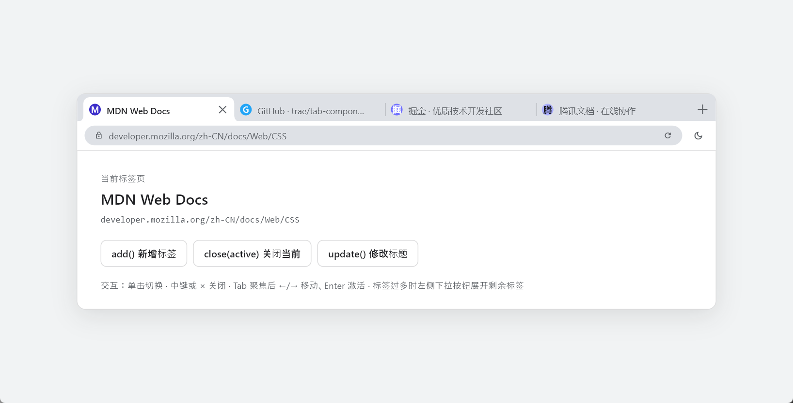
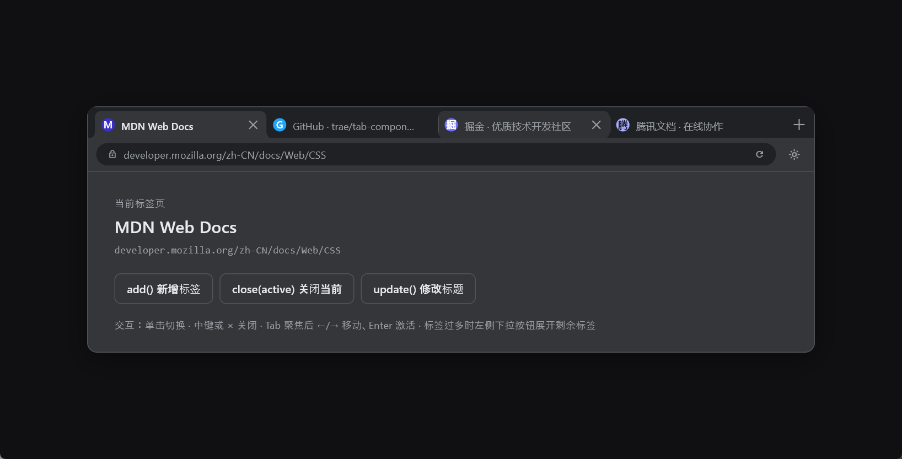
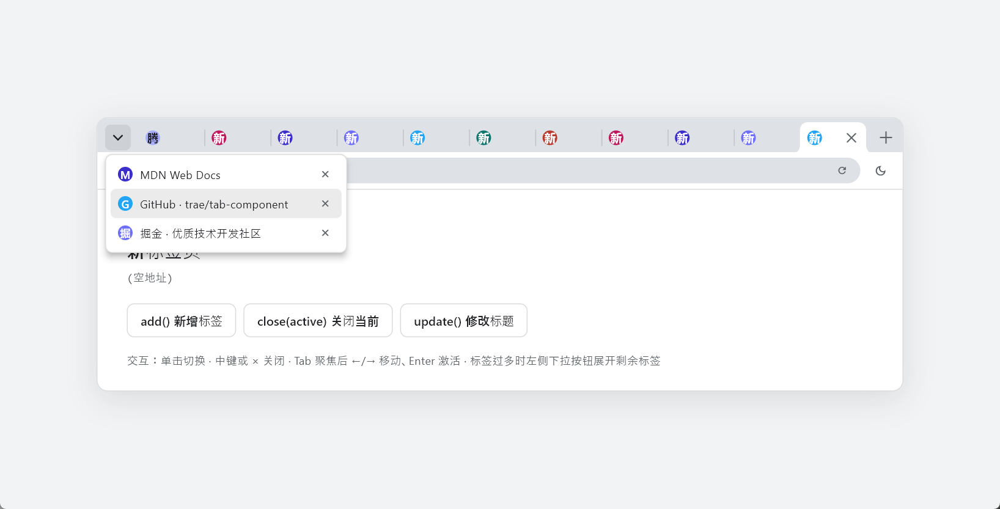

# browser_tab_bar

**English** | [中文](#中文)

A Chrome-style browser tab bar (pure UI library). **Contains only the tab strip itself — page content is up to you**: drive tab add/close/activate/update through `TabBarController`, and render whatever content you like for the active tab.

## Screenshots

| Light | Dark |
| --- | --- |
|  |  |



## Features

- Chrome look: tab height 34 / strip height 38, top corner radius 8px, flexible equal-width tabs (72–240px)
- Overflow dropdown: when tabs no longer fit, a square dropdown button appears on the left listing the hidden tabs (activate / close from the menu); the active tab always stays in the visible window
- Active tab has 8px concave-flare "ears" on both sides, blending into the toolbar below; the transparent quarters reveal the real background of neighboring tabs
- Interactions: click to switch, × / middle-click to close, closing the active tab activates the right neighbor (or left if none), closing the last tab auto-creates a "New Tab"
- Keyboard: roving focus + ←/→ to move (including hidden tabs, the visible window auto-pans) + Enter/Space to activate
- Animations: hover / close-button exponential ease-out fades (~150ms)
- Light & dark themes: `TabBarStyle.light` / `TabBarStyle.dark`; defaults to `Theme.brightness`
- Zero third-party dependencies

## Usage

```dart
import 'package:browser_tab_bar/browser_tab_bar.dart';

final controller = TabBarController(
  initialTabs: const [TabData(title: 'Docs', url: 'flutter.dev')],
);

// Read / operate
controller.tabs;            // List<TabData>
controller.active();        // active id
controller.add(const TabData(title: 'New Tab'));
controller.close(id);
controller.activate(id);
controller.update(id, title: 'New title', url: 'example.com');

// Listen for changes (activate / add / close) and render your own content
controller.onChange = (event) => setState(() { /* your content */ });

// Put up the strip (height 38, fills the available width)
ChromeTabBar(controller: controller);
```

The content area is entirely yours — `ChromeTabBar` renders no tab content.

Integration note: the active tab and the toolbar below it share the same color and are meant to visually connect. Give your toolbar an opaque background and overlap it slightly onto the bottom edge of the strip (see `example/lib/main.dart`, which uses `Transform.translate(0, -1)` to hide a hairline seam at fractional DPI scales).

## Example

The `example/` folder is a complete demo app (tab strip + custom omnibox toolbar + custom content area, via path dependency):

```
cd example
flutter run
```

## Tests

```
flutter test
```

---

# 中文

[English](#english) | **中文**

Chrome 风格浏览器标签栏组件（纯 UI 库）。**只包含标签条本体，页面内容由使用方自定义**：通过 `TabBarController` 驱动标签增删改查，自行渲染激活标签对应的内容。

## 截图

| 浅色 | 深色 |
| --- | --- |
|  |  |


## 特性

- Chrome 形态：tab 高 34 / 条高 38，顶部圆角 8px，宽 72–240px 弹性等分
- 溢出下拉：标签放不下时左侧出现矩形下拉按钮，展开剩余标签菜单（可激活 / 关闭）；激活项始终保持在可见窗口内
- 激活 tab 两侧 8px 耳角（concave flare），与工具栏同色连通；透明区透出邻 tab 真实背景
- 交互：单击切换、× / 中键关闭、关闭激活 tab 自动接右邻（无则左邻）、最后一个关闭自动补"新标签页"
- 键盘：roving focus + ←/→ 移动（含隐藏标签，可见窗口自动平移）+ Enter/Space 激活
- 动效：悬停 / 关闭钮指数 ease-out 渐变（~150ms）
- 明暗主题：`TabBarStyle.light` / `TabBarStyle.dark`，不传则跟随 `Theme.brightness`
- 零第三方依赖

## 用法

```dart
import 'package:browser_tab_bar/browser_tab_bar.dart';

final controller = TabBarController(
  initialTabs: const [TabData(title: '文档', url: 'flutter.dev')],
);

// 读取/操作
controller.tabs;            // List<TabData>
controller.active();        // 激活 id
controller.add(const TabData(title: '新标签页'));
controller.close(id);
controller.activate(id);
controller.update(id, title: '新标题', url: 'example.com');

// 监听变化（activate / add / close），据此渲染你自己的内容区
controller.onChange = (event) => setState(() { /* 自定义内容 */ });

// 放入标签条（高度 38，自动占满宽度）
ChromeTabBar(controller: controller);
```

内容区完全由你决定——`ChromeTabBar` 不渲染任何标签内容。

集成提示：激活 tab 与下方工具栏是"同色连通"的，工具栏请使用不透明背景色，并叠在标签条底部边缘之上（演示见 `example/lib/main.dart`，其中用 `Transform.translate(0, -1)` 消除分数 DPI 下的拼缝灰线）。

## 运行示例

`example/` 是完整演示 app（标签条 + 自定义 omnibox 工具栏 + 自定义内容区，path 依赖本包）：

```
cd example
flutter run
```

## 测试

```
flutter test
```
